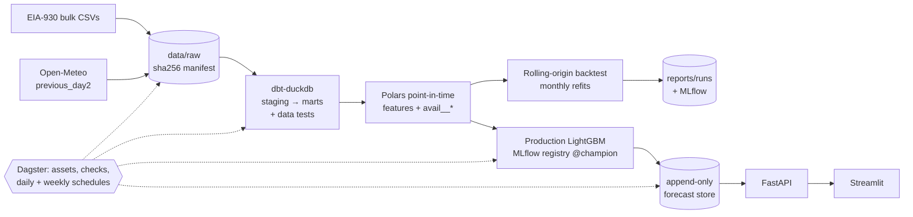

# GridCast

**Day-ahead electricity-demand forecasts for the ten largest US grid regions, scored every day
against the grid operators' own published forecasts, under a protocol that makes information
leakage impossible to miss.**

[](https://github.com/Rizzzyyy1/grid-demand-forecasting/actions/workflows/ci.yml)

Python 3.13 · uv · Polars · DuckDB · dbt · Dagster · LightGBM · N-HiTS (PyTorch) · MLflow ·
FastAPI · Streamlit · Docker Compose · GitHub Actions

Every US balancing authority (BA) publishes a day-ahead forecast of its hourly demand, and EIA
republishes it next to the demand that actually happened. That gives an unusually honest
benchmark: professionals with better data than this project has, scored on the same hours.
GridCast asks **how close an open pipeline built only from public data can get — in which
regions, seasons and hours it wins or loses, and why.** Losing by a measured, explained margin is
a valid result; the project is judged on rigour, not on winning.

## Live

**Dashboard: https://rizzzyyy1.github.io/grid-demand-forecasting/**

Every day at 12:30 UTC a scheduled GitHub Actions job runs the whole pipeline at zero cost. It
downloads recent EIA and weather data, runs `dbt build` with its data tests, issues tomorrow's
forecasts with the frozen, checksummed model, scores past days against published actuals, and
redeploys the dashboard.

* Issued forecasts are appended to the [`live-data`](../../tree/live-data) branch as immutable
  files; a guard refuses any commit that would rewrite one.
* The live record only covers days after the locked test window and is never mixed with
  backtest numbers.
* The job runs in a live mode that cannot train, backtest or touch the test split.

Details: [ADR-0009](docs/adr/0009-free-live-deployment-on-github.md).

## Results

<!-- results:start -->
Validation run `20260923T212828Z-final-v3` · target days 2023-07-01 → 2024-06-30 · 15 monthly refits · leakage check: 5,928,038 feature values, 0 violations.

**MAPE (%) by region** (lower is better; bold = best of our models):

| BA | seasonal_naive | operator | operator_debiased | lgbm_global | nhits | ridge |
|---|---|---|---|---|---|---|
| CISO | 6.60 | 6.27 | 2.67 | **3.20** | 4.48 | 4.40 |
| ERCO | 8.10 | 2.42 | 2.38 | **4.02** | 4.69 | 5.40 |
| FPL | 8.75 | 3.22 | 2.18 | **4.20** | 5.99 | 5.95 |
| ISNE | 10.35 | 2.49 | 1.90 | **5.26** | 6.49 | 6.73 |
| MISO | 6.80 | 3.11 | 1.75 | **2.57** | 3.13 | 4.15 |
| NYIS | 8.33 | 2.63 | 1.74 | **3.47** | 4.62 | 4.91 |
| PJM | 8.56 | 3.59 | 2.06 | **2.93** | 3.74 | 5.04 |
| SOCO | 9.76 | 1.91 | 0.95 | **4.43** | 5.11 | 6.49 |
| SWPP | 8.10 | 2.56 | 2.58 | **3.39** | 3.81 | 5.05 |
| TVA | 11.00 | 2.38 | 2.40 | **4.26** | 5.49 | 7.07 |

**Skill of `lgbm_global` vs the debiased operator forecast** (1 - MAE/MAE_ref; 95 % moving-block bootstrap CI; Diebold-Mariano p): significantly better in 0, significantly worse in 10, inconclusive in 0 of 10 regions.

| BA | skill | 95 % CI | DM p |
|---|---|---|---|
| CISO | -0.195 | [-0.274, -0.122] | 5.4e-07 |
| ERCO | -0.728 | [-0.982, -0.512] | 1.4e-06 |
| FPL | -0.830 | [-0.992, -0.709] | 1.6e-32 |
| ISNE | -1.790 | [-1.995, -1.586] | 3.5e-60 |
| MISO | -0.473 | [-0.676, -0.313] | 9.7e-06 |
| NYIS | -0.995 | [-1.163, -0.853] | 1e-29 |
| PJM | -0.459 | [-0.689, -0.273] | 4.2e-05 |
| SOCO | -4.004 | [-5.310, -2.911] | 1.6e-11 |
| SWPP | -0.340 | [-0.521, -0.172] | 0.00072 |
| TVA | -0.790 | [-1.267, -0.489] | 9.8e-05 |

Full tables: [`reports/runs/20260923T212828Z-final-v3/summary.md`](reports/runs/20260923T212828Z-final-v3/summary.md).
<!-- results:end -->

The test period (2024-07-01 → 2026-06-30) is **locked**: the CLI refuses to evaluate it without
an explicit flag and records that it happened, so it can be evaluated once, after the model set is
frozen. Numbers above are generated by `scripts/collect_results.py` from `reports/runs/`; none are
typed by hand.

## What makes the numbers trustworthy

| Risk | What GridCast does |
|---|---|
| **Leakage** | Forecasts are issued 10:00 local on D-1. Every feature value carries an `avail__*` timestamp derived from its *source rows*; a vectorised check asserts `available_at ≤ issued_at` for every cell (millions per run), a Hypothesis perturbation test scrambles all post-issue data and asserts features do not change, and deliberately leaky features are shown to fail. |
| **Weather hindsight** | Only archived GFS forecasts made **48 h before** each valid hour (Open-Meteo `previous_day2`). Using observed weather is detected as leakage. |
| **Data latency** | Two protocols ([ADR-0007](docs/adr/0007-two-data-latency-protocols.md)): `realtime` (demand to 06:00 D-1) for research, `bulk` (demand to the end of D-3, which is all EIA's keyless daily file allows at 10:00 ET) for the live loop — so the live model is trained on exactly what it sees in production. |
| **Soft benchmark** | Two operator series have systematic, non-forecasting offsets (CISO midday, SWPP from May 2025 — see the [data profile](reports/data_profile.md)). Every table reports skill against the raw operator *and* a point-in-time **debiased** operator ([ADR-0005](docs/adr/0005-bias-corrected-operator-benchmark.md)); headline claims use the harder one. |
| **Overstated confidence** | 95 % CIs from a moving-block bootstrap over *days* (hours within a day are correlated) and Diebold–Mariano tests with a HAC variance. |
| **DST** | 23- and 25-hour days are first-class; `core/time.py` owns every conversion and a dbt test checks that recomputed local dates/hours equal EIA's on every row. MISO reports on fixed EST, which the registry encodes. |
| **Test-set peeking** | Validation 2023-07 → 2024-06 for all decisions; test split locked (above). |

## Architecture



```
src/gridcast/
  core/           time & DST, calendar, BA registry, domain models, Pandera contracts, settings
  ingestion/      EIA bulk + Open-Meteo clients (retries, weighted rate limiter, manifests)
  warehouse/      dbt runner, seeds generated from the registry, typed reads, data profile
  features/       point-in-time feature builder + leakage check
  models/         Forecaster protocol; seasonal naive, ridge, LightGBM, N-HiTS, CQR, operator benchmarks
  evaluation/     rolling-origin engine, metrics, block bootstrap, Diebold–Mariano
  experiments/    end-to-end runs → reports/runs/<id>/ + MLflow
  live/           production model registry, daily issuance, immutable store, live scoring
  serving/ ui/    FastAPI and Streamlit (the UI only talks to the API)
  orchestration/  Dagster definitions
transform/        dbt project (staging, intermediate, marts, generic tests)
```

Import direction is enforced by `import-linter` (`make arch`): `core` imports nothing internal,
modelling code never imports ingestion, nothing imports the application edges.

## Models (each must beat the one below it — [ADR-0003](docs/adr/0003-model-ladder.md))

| Model | Idea |
|---|---|
| `operator`, `operator_debiased` | Benchmarks, implemented as forecasters so they share the protocol |
| `seasonal_naive` | Same local hour one week earlier; empirical intervals |
| `ridge` | Per-BA ridge on hour/weekday one-hots, lag ratios, temperature splines |
| `lgbm_global` | One LightGBM across BAs predicting demand ÷ recent level; quantile heads for 80/95 % intervals |
| `nhits` | N-HiTS (neuralforecast) over the ten hourly series with future-known temperature/calendar inputs; input truncated at each origin's cutoff and asserted |
| `*+cqr` | Rolling conformalized quantile regression on each model's own out-of-sample residuals |

## Quick start

```bash
make install                     # uv sync --all-extras + pre-commit (macOS: brew install libomp)
uv run gridcast ingest eia       # ~0.7 GB, idempotent
uv run gridcast ingest weather   # resumable; the free-tier quota covers the archive in ~1 day
uv run gridcast build            # dbt build: seeds, staging, marts, data tests
uv run gridcast profile          # reports/data_profile.md
uv run gridcast backtest         # validation split -> reports/runs/<id>/ + MLflow
python scripts/collect_results.py --readme
uv run gridcast train && uv run gridcast forecast && uv run gridcast score   # live loop
docker compose up --build        # API :8000/docs · dashboard :8501 · Dagster :3000 · MLflow :5001
```

`make check` runs what CI runs: Ruff, `mypy --strict`, import-linter contracts and the hermetic
test suite (no network, no keys). `make test-all` adds the slow dbt-integration and N-HiTS tests.

## Decisions

Every non-obvious choice is an ADR in [`docs/adr/`](docs/adr/): benchmarking against operators
(0001), DuckDB + dbt rather than Spark/Kafka/a feature store (0002), the model ladder (0003),
weather inputs (0004), the debiased benchmark (0005), features in Polars not dbt (0006), the two
latency protocols (0007), a single-host AWS deployment that is validated but intentionally not
deployed because of cost (0008), and the zero-cost live system on GitHub Actions + Pages (0009). The design is in [`docs/DESIGN.md`](docs/DESIGN.md) and the phase plan in
[`docs/ROADMAP.md`](docs/ROADMAP.md).

## Data sources and licences

EIA-930 hourly electric grid monitor (U.S. Energy Information Administration, public domain).
Weather: [Open-Meteo](https://open-meteo.com/) Previous Runs API (CC BY 4.0; free tier for
non-commercial use). City populations in `regions.yaml` are approximate and used only as
relative weights.
